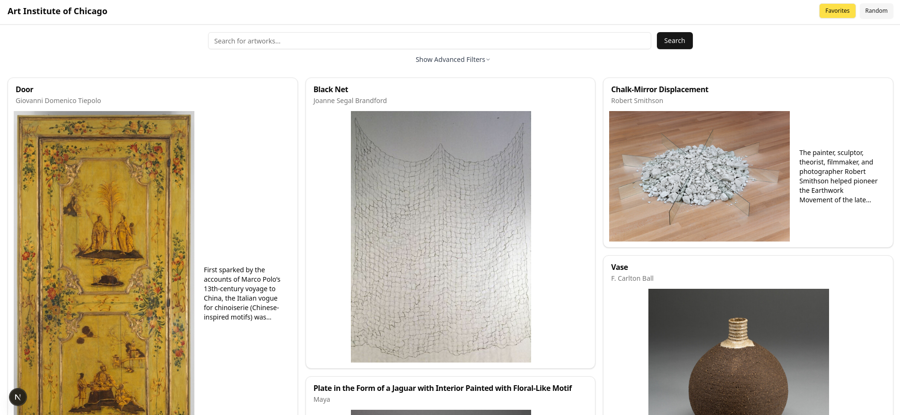
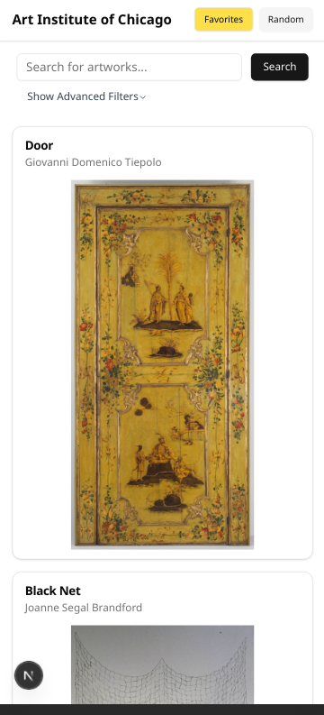
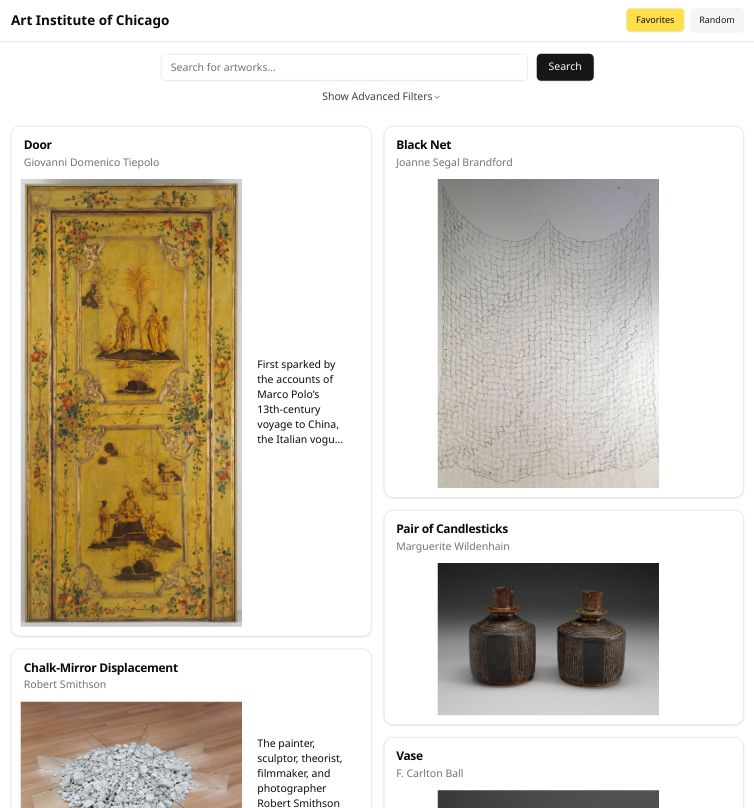
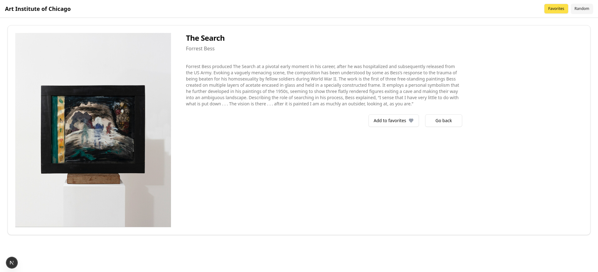
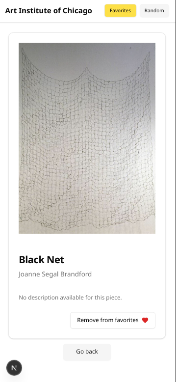
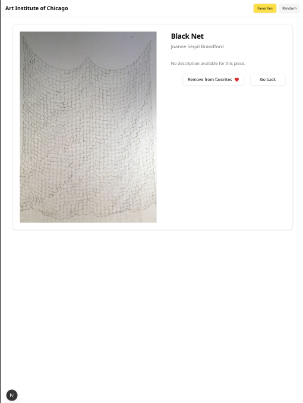
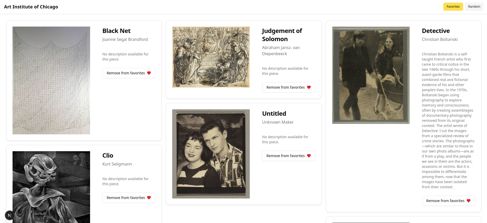
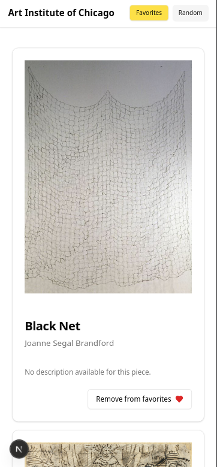
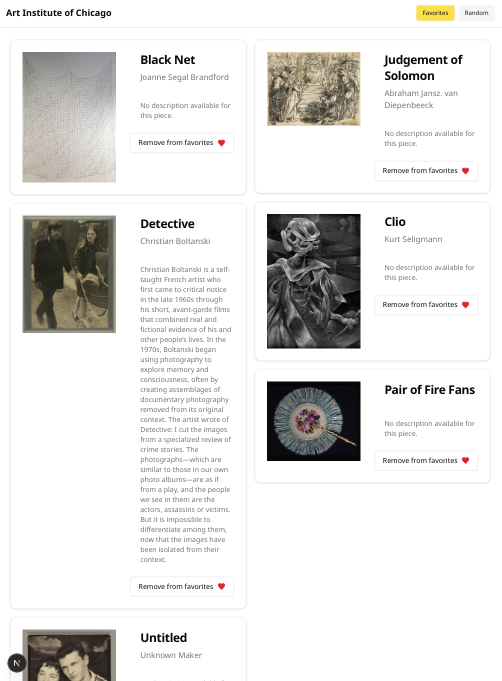

Live en: https://challenge-banza-38bp.vercel.app/

Instrucciones para levantar:
```
npm install
npm run dev
```

Herramientas utilizadas:
Typescript
Next.js
Shadcn
Tailwind
React-masonry-css
Lucide
Radix

El sitio posee 3 vistas dependiendo si es mobile, tablet y desktop. Tambien agregue un boton de "Random" que te envia a la pagina de un cuadro aleatorio.
En desktop y tablet un extracto de la descripcion de cada pieza puede ser visto en cada tarjeta (si es que la pieza tiene descripcion). Un extracto mas grande es visto al hoverear sobre la tarjeta, con un texto indicando que se puede clickear la tarjeta para leer toda la informacion. En mobile la descripcion no es visible por cuestiones de espacio.

Debajo de la barra de busqueda hay una opcion para hacer busquedas con filtros mas especificos, dependiendo si la obra es de dominio publico o si esta en exhibicion en este momento.





Pagina del item:




Pagina de favoritos:



Clickear en una de las tarjetas desde la pagina de favoritos envia a la pagina del item